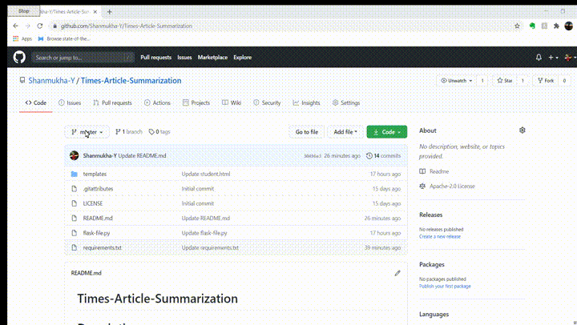
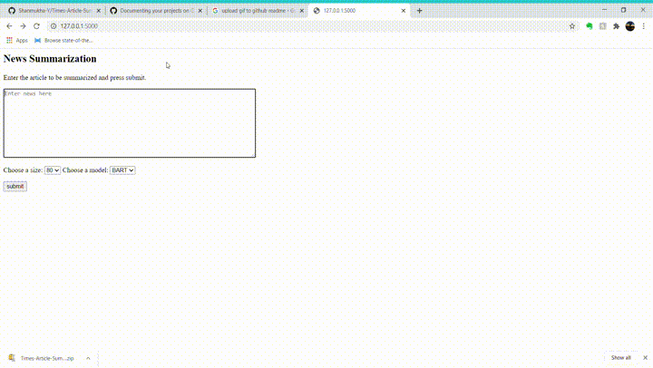

# Times-Article-Summarization

# Description
A simple flask app that takes in a news article, size and model as input and outputs the summary with the required size from the selected model.

- TIME_Seq2Seq2.ipynb is the from scratch implementation of the sequence 2 sequence algorithm to generate summaries on the Times Data.
- transormers_summarization.ipynb is the Transfer learning approach, where we trained the T5 model's last layer on the Times data.
- Flask file.py consists of the pretrained models of T5 and BART along with a simple web UI

# Installation:
- Install python 3.6 with pip and add python to path when prompted
- To check pip installation type "pip" in command prompt, this would list all the commands compatible with pip.

Download this repository manully into your machine.

Open command prompt and change directory to this repository and enter the following command:
- pip install -r requirements.txt

This will install all the required libraries to execute this program on your local machine.

# Usage
- launch the flask app by typing: 'python flask-file.py' in the command prompt
- Upon launching the flask app through command prompt open http://127.0.0.1:5000/ displayed on the command prompt.
- Here you will find a text area and 2 dropdown menus to slect the summary size and model.
- After entering the the news article and choosing the size and model press submit.
- Wait until a page showing the summary of the entered article is displayed in another text area.

# Demo

# Credits 

Thanks for these wonderful people's contributions:
- https://github.com/AparGarg99
- Saiteja A
